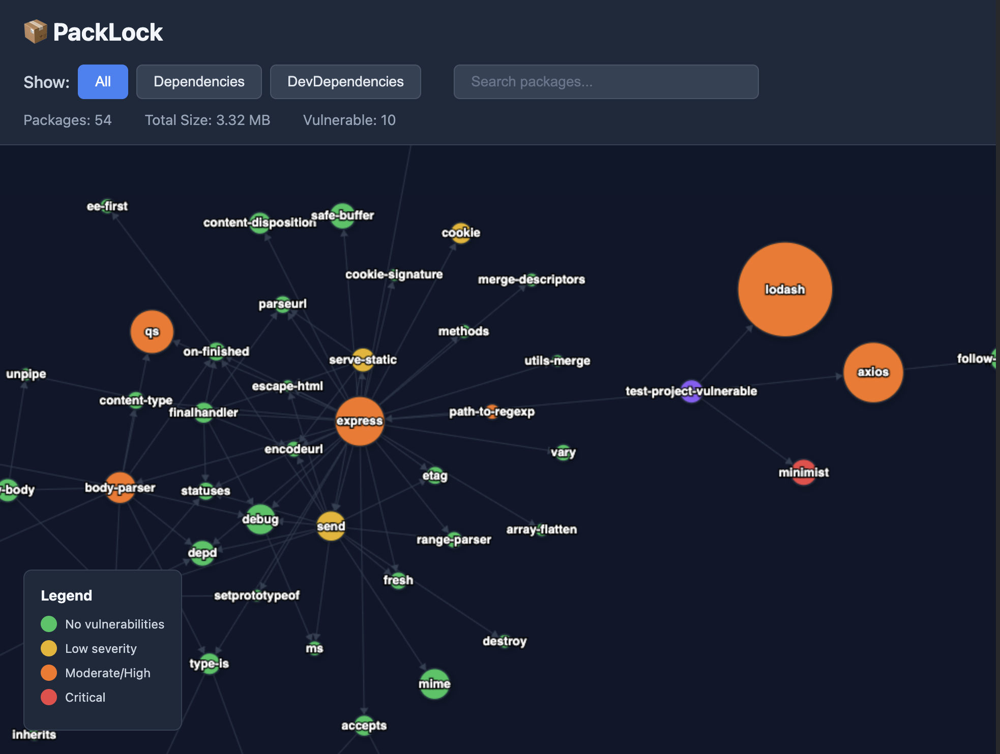
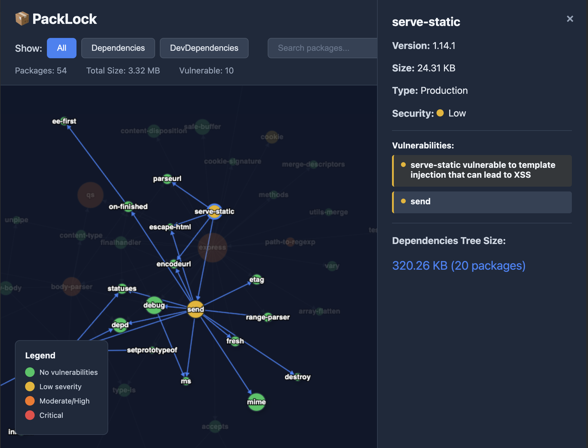

# PackLock

Visualize your npm dependency graph with package sizes and security vulnerabilities.

<div align="center">
  
  
</div>

## Installation

```bash
npm install -D packlock
# or globally
npm install -g packlock
```

## Usage

```bash
# In your project directory
npx packlock

# Disable auto-open browser
npx packlock --no-open
```

This will:
1. Parse your `package-lock.json`
2. Analyze `node_modules` sizes (own files only, excluding nested dependencies)
3. Run `npm audit` for security vulnerabilities
4. Build dependency graph with deduplication
5. Generate an interactive visualization in `.packlock/index.html`
6. Automatically open in your browser

## Features

### 🎨 Interactive Visualization
- **Force-directed graph** with physics simulation
- Nodes repel each other, edges pull them together
- Beautiful floating bubble effect
- Smooth animations at 60 FPS

### 📦 Package Analysis
- Shows **actual sizes** from `node_modules`
- Each node size represents the package's own files (excluding sub-dependencies)
- Hover over nodes to see details
- Click to open detailed panel

### 🔒 Security Audit
- Automatically runs `npm audit`
- Color-coded vulnerability severity:
  - 🟢 **Green**: No vulnerabilities
  - 🟡 **Yellow**: Low severity
  - 🟠 **Orange**: Moderate/High severity
  - 🔴 **Red**: Critical vulnerabilities
  - 🟣 **Purple**: Root package

### 🔍 Filtering & Search
- **Filter by type**: All / Dependencies / DevDependencies
- **Search**: Find packages by name
- **Smart deduplication**: Shared dependencies shown once with multiple edges

### 🔎 Navigation
- **Zoom**: Mouse wheel
- **Pan**: Click and drag
- **Select**: Click on node to see details
- **Hover**: Highlights nodes on mouse over

## Graph Layout

The visualization uses a force-directed algorithm:
- **Root node** (your project) in the center
- **Direct dependencies** spread around it
- **Transitive dependencies** positioned near their parents
- **Shared dependencies** connected to multiple packages with lines

Node radius is calculated as: `sqrt(packageSize) * scaleFactor`

## Output

Generated files in `.packlock/` directory:
- `index.html` - Standalone visualization (open in any browser)
- `index.css` - Styles
- `index.js` - Graph renderer with embedded data

**Add to `.gitignore`:**
```
.packlock/
```

## Command Line Options

```bash
npx packlock              # Run with auto-open
npx packlock --no-open    # Generate without opening browser
```

## Requirements

- Node.js >= 14.0.0
- `package-lock.json` in current directory
- `node_modules` installed (`npm install`)

## How It Works

1. **Parser**: Reads `package-lock.json` (supports v1, v2, v3)
2. **Analyzer**: Recursively scans `node_modules`, calculates sizes
3. **Auditor**: Runs `npm audit --json`, maps vulnerabilities
4. **Graph Builder**: Creates nodes and edges, deduplicates shared packages
5. **Generator**: Creates HTML/CSS/JS with embedded graph data
6. **Renderer**: Canvas-based force-directed layout with physics

## API

You can also use packlock programmatically:

```javascript
const packlock = require('packlock');

const lockfileData = packlock.parseLockfile('./package-lock.json');
const sizes = await packlock.analyzeSizes('./node_modules', lockfileData.packages);
const auditData = await packlock.runAudit('./');
const graph = packlock.buildGraph(lockfileData, sizes, auditData);
packlock.generateFiles('./.packlock', graph);
```

## Performance

- Parsing: < 100ms for most projects
- Size analysis: 1-5s depending on node_modules size
- Audit: Depends on network (uses npm registry)
- Rendering: Smooth 60 FPS for graphs up to ~500 nodes

## Troubleshooting

**Error: package-lock.json not found**
- Make sure you're in a project directory with `package-lock.json`

**Error: node_modules not found**
- Run `npm install` first

**Slow analysis**
- Large node_modules can take a few seconds
- The tool scans all files to calculate sizes

**npm audit fails**
- Requires internet connection
- Some old projects may not support audit
- Tool will continue without vulnerability data

## Contributing

PRs welcome! Ideas for improvements:
- [ ] WebGL rendering for large graphs (1000+ nodes)
- [ ] Export as PNG/SVG
- [ ] Compare two package-lock files
- [ ] Show cumulative sizes (with all dependencies)
- [ ] Integration with CI/CD
- [ ] Historical size tracking

## License

MIT
